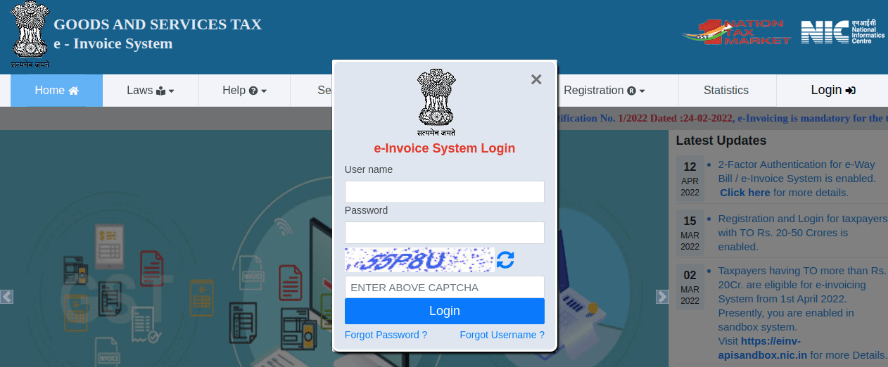
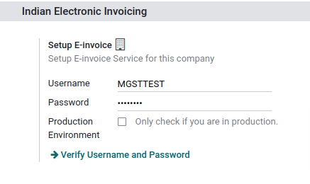
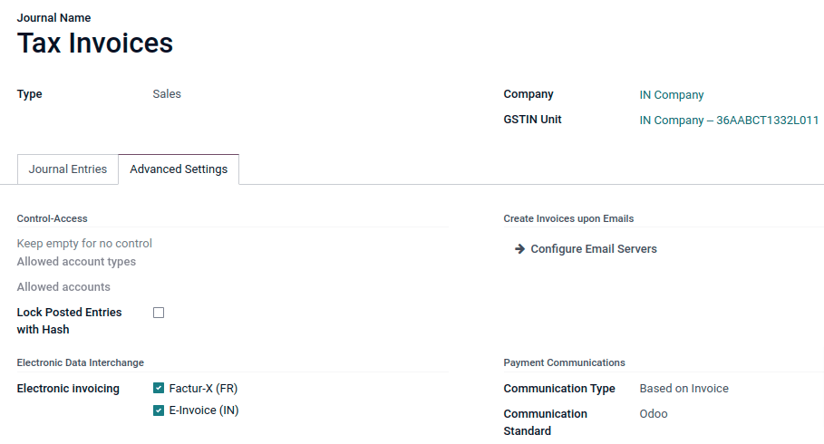
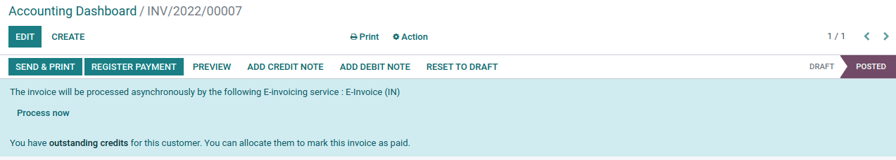
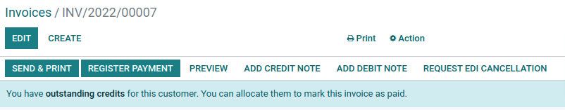

=====
India
=====

.. _india/installation:

Installation
============

:ref:`Install <general/install>` the following modules to get all the features of the Indian
localization:

.. list-table::
   :header-rows: 1

   * - Name
     - Technical name
     - Description
   * - :guilabel:`Indian - Accounting`
     - ``l10n_in``
     - Default :doc:`fiscal localization package <../overview/fiscal_localization_packages>`
   * - :guilabel:`Indian E-invoice Integration`
     - ``l10n_in_edi``
     - :ref:`Indian e-invoicing integration <india/e-invoicing>`

.. _india/e-invoicing:

Indian e-invoicing
==================

Odoo is compliant with the :guilabel:`Indian e-invoicing` requirements.

.. important::
   Indian e-invoicing is available from Odoo 15.0. If needed, :doc:`upgrade
   </administration/upgrade>` your database.

.. _india/e-invoice-web-portal:

Registration on e-invoice web portal
------------------------------------

You must register on NIC E-Invoice web portal to get your API credentials. You need these
information to :ref:`configure your Odoo Accounting app <india/e-invoicing-configuration>`.

.. tip::
   In case you need to create API username and password, please refer to this documentation:
   :ref:`Create API User <india/e-invoice-api_registration>`

.. _india/e-invoicing-configuration:

Configuration on Odoo
---------------------

To setup e-invoice service, go to :menuselection:`Accounting --> Configuration --> Settings -->
Indian Electronic Invoicing`,
and set the :guilabel:`Username` and :guilabel:`Password`.

.. _india/e-invoicing-journal-configuration:

Journal configuration
~~~~~~~~~~~~~~~~~~~~~

To configure your journals, go to :menuselection:`Accounting --> Configuration --> Journals`.
Open your 'sales' type journal, and in the :guilabel:`Advanced Settings` tab, under
:guilabel:`Electronic Data Interchange`, check :guilabel:`E-Invoice (IN)` and
:guilabel:`Save`.

.. _india/e-invoicing-workflow:

Workflow
--------

To start invoicing from Odoo, an invoice must be created using the standard invoicing flow,
that is, either from a sales order or the invoice menu in the Accounting application

.. seealso::
   - `Odoo Tutorials: Sales Tutorials <https://www.odoo.com/slides/sales-17>`_
   - `Odoo Tutorials: Accounting <https://www.odoo.com/slides/accounting-19>`_

Invoice validation
~~~~~~~~~~~~~~~~~~

Once the invoice is validated, the following message is displayed at the top:

Odoo will automatically upload the JSON-signed file to the government portal. But if you want
to process the invoice immediately, you can click on :guilabel:`Process Now`.

.. note::
   You can find the JSON-signed file in the attachment.

You can check the status of EDI with web-service under the :guilabel:`EDI Document` tab or the
:guilabel:`Electronic invoicing` field.

Invoice PDF Report
~~~~~~~~~~~~~~~~~~

After the invoice is submitted and validated, the invoice PDF report can be printed. The report
includes IRN, acknowledgment number and date, and QR code, indicating the invoice is a valid fiscal
document.

.. image:: india/invoice-report.png
   :align: center
   :alt: IRN and QR code

EDI Cancellation
~~~~~~~~~~~~~~~~

If you want to cancel an e-invoice, enter a cancel reason and remarks in the :guilabel:`Other info`
tab of the invoice.

.. image:: india/e-invoice-cancellation.png
   :align: center
   :alt: cancel reason and remarks

After clicking on :guilabel:`Request EDI cancellation`, the status of the
:guilabel:`Electronic invoicing` field will be :guilabel:`To Cancel`.

.. note::
   If you want to abort cancellation before processing the invoice, then click on
   :guilabel:`Call Off EDI Cancellation`.

Once you request for canceling the e-invoice, Odoo will automatically submit the JSON Signed file
to the government portal. But, if you want to process the invoice immediately, you can process it
by clicking on :guilabel:`Process Now`.

Others
------

.. _india/verify-e-invoice:

Verify E-invoice
~~~~~~~~~~~~~~~~

After submitting an e-invoice, you can also verify the signed invoice from the government portal.

#. Download the JSON file from the attachment.

#. Open the e-invoice portal: https://einvoice1.gst.gov.in/
   and go to :menuselection:`Search --> Verify Signed Invoice`.

#. Select the JSON file and submit it.

   .. image:: india/verify-invoice.png
      :align: center
      :alt: select the JSON file for verify invoice

#. You can check the verified signed e-invoice here.

   .. image:: india/signed-invoice.png
      :align: center
      :alt: verified e-invoice

.. _india/e-invoice-api_registration:

E-Invoice API Registration
~~~~~~~~~~~~~~~~~~~~~~~~~~

#. Login to the NIC E-Invoice web portal on - https://einvoice1.gst.gov.in/.

   .. note::
      If you have already registered on the NIC Eway Bill Production portal, then you may use the
      same Login credentials here on - https://einvoice1.gst.gov.in/ .

#. Click on :guilabel:`Login` and enter your :guilabel:`Username` and :guilabel:`Password`.

   .. image:: india/e-invoice-system-login.png
      :align: center
      :alt: e-invoice system login

#. After logging in, you are presented with this screen. Now, click on :guilabel:`API Registration`

   .. image:: india/api-registration.png
      :align: center
      :alt: Click on API registration

#. Click on :guilabel:`User Credentials`. After that, click on :guilabel:`Create API User`.

   .. image:: india/e-invoice-create-api-user.png
      :align: center
      :alt: Click on User Credentials and Create API User

#. After that, you receive an OTP to your registered mobile Number.

   .. image:: india/trigger-otp.png
      :align: center
      :alt: Trigger an OTP to your registerd phone number

#. Enter OTP and click on :guilabel:`Verify OTP`.

#. Click on :guilabel:`Through GSP` and select :guilabel:`Terasoft Software Limited` as your GSP.

   .. image:: india/select-gsp.png
      :align: center
      :alt: Select your GSP

#. Create API specific :guilabel:`Username` and :guilabel:`Password` & Click on :guilabel:`Submit`.

   .. image:: india/submit-api-registration-details.png
      :align: center
      :alt: Submit API specific Username and Password

#. Confirm acknowledgement from e-invoice System.

   .. image:: india/confirm-acknowledgement.png
      :align: center
      :alt: Confirm acknowledgement