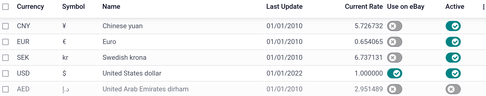
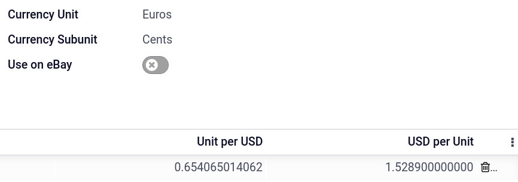
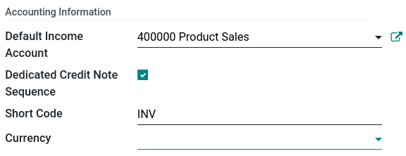

====================
Multicurrency system
====================

Odoo allows you to emit and receive bills, invoices, and other documents in multiple currencies
other than the main currency configured for your company. You also set up bank accounts in other
currencies and run reports on your foreign currency activities.

Configuration
=============

Enable foreign currencies
-------------------------

Go to :menuselection:`Accounting --> Configuration --> Settings --> Currencies` and under the main
currency of your company, click on :guilabel:`Currencies`. From here, enable the currencies you wish
to use by toggling the :guilabel:`Active` button.

Currency rates
--------------

To manually create and set a currency rate, from the previous menu where you activate or deactivate
currencies, click on the currency you wish to change the rate of. Under the :guilabel:`Rates` tab,
click :guilabel:`Add a line` to create a new rate.

When you activate a second currency for the first time, :guilabel:`Automatic Currency Rates` appears
under :menuselection:`Accounting Dashboard --> Configuration --> Settings --> Currencies`. By
default, you have to click on the **Update now** button (:guilabel:`🗘`) to update the rates.
However, Odoo can update the rates at regular intervals. To do so, change the :guilabel:`Interval`
from :guilabel:`Manually` to :guilabel:`Daily`, :guilabel:`Weekly`, or :guilabel:`Monthly`. You can
also select the web service from which you want to retrieve the latest currency rates by clicking on
the :guilabel:`Service` field.

Exchange rate journal
---------------------

Odoo automatically records exchange differences in an **Exchange Difference** journal, which can be
found under :menuselection:`Accounting --> Configuration --> Accounting: Journals`.

The **Exchange Difference** journal records the differences between the invoiced amount at the
creation date of the invoice and the amount received at the date of the payment. For example, if a
payment is received one month after the invoice was issued, the exchange rate has likely changed
since. This fluctuation therefore implies some profit or loss due to the exchange difference, which
Odoo automatically records.

Chart of accounts configuration
-------------------------------

In the accounting application, go to :menuselection:`Configuration --> Accounting: Charts of
Accounts`. Each account can have a set currency. By doing so, all moves relevant to the account are
forced to have that account's currency. If left empty, all active currencies are handled, instead of
just one.

Journals configuration
----------------------

Similarly to accounts, if a currency is set on a **journal**, that journal will only handle
transactions in that currency. To allow a **journal** to handle all currencies go to
:menuselection:`Accounting --> Configuration --> Accounting: Journals`, select the journal you want
to edit, and, leave the :guilabel:`Currency` field empty.

Invoices, bills, and payments
=============================

Invoices, bills, and other documents
------------------------------------

For all documents, you can select the currency and journal to use for the transaction.

.. image:: multicurrencies/currency-field.png
   :align: center
   :alt: Select the currency and journal to use.

Payment registration
--------------------

To register a payment in a currency other than your company's main currency. Simply click on the
:guilabel:`Register Payment` payment button of your document. In the pop-up window, enter the
**currency** in the :guilabel:`Amount` field, and select a :guilabel:`Journal`.

.. image:: multicurrencies/register-payment.png
  :align: center
  :alt: Select the currency and journal to use before registering the payment.

Bank statements
---------------

When creating or importing bank statements, the amount is in the company's main currency. To see
additional fields related to foreign currencies, click on the **columns dropdown button**
(:guilabel:`⋮`) next to :guilabel:`Amount`, and check :guilabel:`Amount Currency` and
:guilabel:`Foreign Currency`.

.. image:: multicurrencies/foreign-fields.png
  :align: center
  :alt: The extra fields related to foreign currencies.

When reconciling, Odoo displays both the foreign currency amount and the equivalent amount in your
company's main currency.

Exchange rate journal
---------------------

To see the **Exchange difference** journal entry, go to :menuselection:`Accounting Dashboard -->
Accounting --> Journals: Miscellaneous`.

.. image:: multicurrencies/exchange-journal-currency.png
   :align: center
   :alt: Exchange rate journal entry.

.. seealso::
   - :doc:`../bank/setup/foreign_currency`