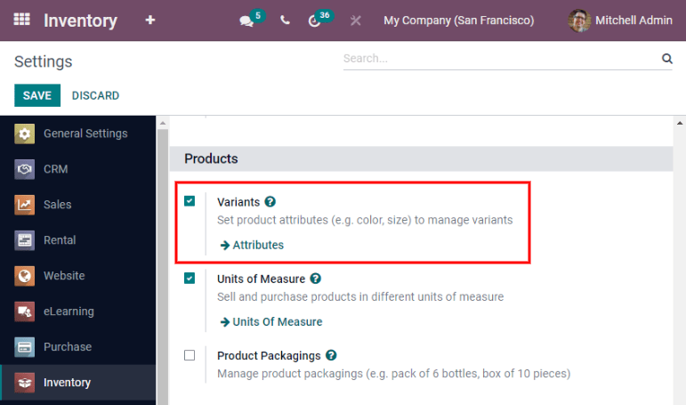
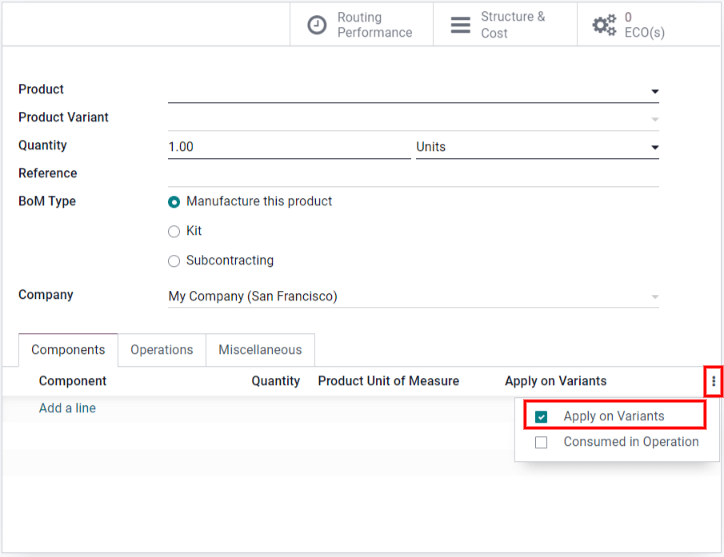
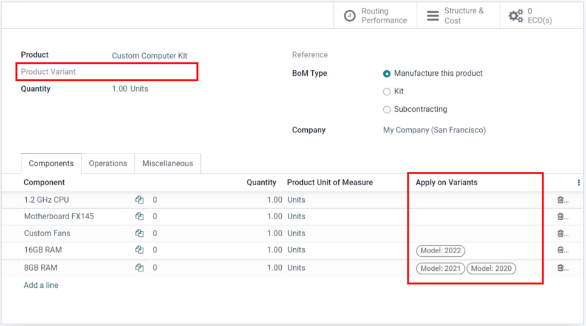

==================================
Managing BoMs for product variants
==================================

Odoo allows one bill of materials to be used for multiple variants of the same product. Having a
consolidated BoM for a product with variants saves time by preventing the need to manage multiple
BoMs. To activate variants, simply navigate to :menuselection:`Inventory --> Configuration -->
Settings --> Variants`. For more information on configuring product variants, refer to `this page
<https://bit.ly/3PZyzDC>`. 

Next, create a new product variant BoM or edit an existing one by going to
:menuselection:`Manufacturing --> Products --> Bills of Materials`. The option to assign components
to specific product variants on the bill of materials is available once variants are fully
configured. If the :guilabel:`Apply on Variants` field is not immediately visible, activate it from
the kebab menu. 

Each component can be assigned to multiple variants. Components with no variants specified are used
in every variant of the product. The same principle applies when configuring operations and
by-products. 

When defining variant BoMs by component assignment, the :guilabel:`Product Variant` field in the
main section of the BoM should be left blank, as shown above. This field is used only when creating
a BoM specifically for one product variant. 
